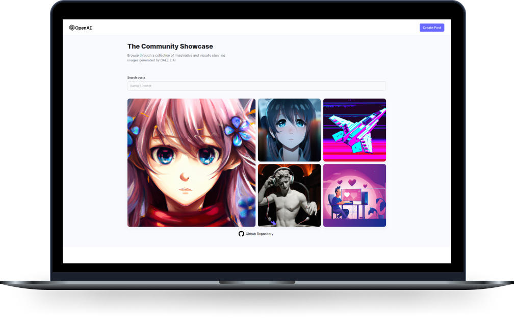

<h1 align="center">DALL-E 2 | Image Generation Application
</h1>

This application allows you to generate unique images based on textual descriptions using the DALL-E 2 API. The API uses deep learning-based artificial intelligence to produce images from written descriptions.

<h1>
  
</h1>

## Technologies

- [ReactJS](https://reactjs.org/)
- [NodeJS](https://nodejs.org/)
- [Cloudinary](https://cloudinary.com/)
- [OpenAI](https://openai.com/api/)
- [MongoDB](https://www.mongodb.com/)
- [TailwindCSS](https://tailwindcss.com/)

## Getting Started

- Clone this repository to your local machine
- Install required packages by running <code>npm install</code>
- Get an API key from OpenAI
- Store your API key as an environment variable named **OPENAI_API_KEY**
- Run the application by executing <code>npm start</code>

## Contributing

If you would like to contribute to this project, please follow these steps:

- Fork the repository
- Create a branch with a descriptive name for your changes
- Commit your changes
- Push to the branch
- Create a pull request

## Show your support

Give a ⭐️ if this project helped you!

## License

This project is licensed under the MIT License. See the [LICENSE](LICENSE) file for details.
